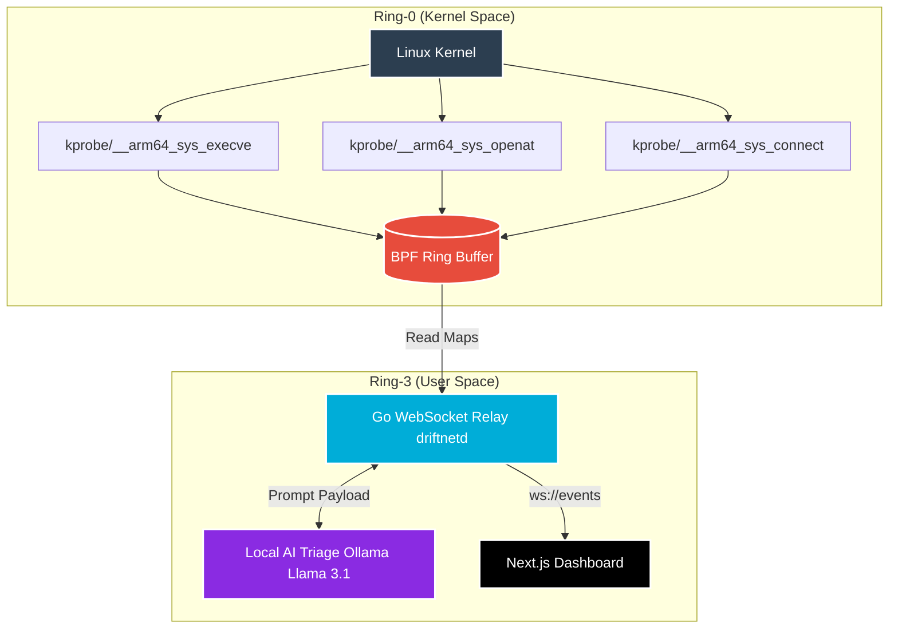

# 🛡️ DriftNet (Project OMNI)

<div align="center">
  
  
  
  
</div>

<br />

**DriftNet** is a hybrid cybersecurity daemon designed for Android edge devices. It leverages Ring-0 eBPF (Extended Berkeley Packet Filter) kernel probes to passively intercept execution, network, and file-system syscalls, while a Ring-3 Go relay and AI engine handle triage. 

Unlike traditional Ring-3 EDRs or user-space hooks (Frida/Xposed) which are easily detected and bypassed by modern malware, DriftNet's telemetry operates entirely in kernel-space, making the probes invisible to userspace applications.

---

## 🔬 Core Architecture

DriftNet is split into four primary layers:
1. **The Kernel Probes (C/eBPF):** Intercepts ARM64 syscalls (`sys_connect`, `sys_execve`).
2. **The Telemetry Relay (Go):** A high-throughput WebSocket server that reads the eBPF BPF map ring buffers.
3. **The Local AI Triage (Ollama Llama 3.1 8B):** Analyzes incoming syscall payloads in real-time, functioning as an intelligent anomaly detection engine to score and block novel zero-day threats.
4. **The Tactical Dashboard (Next.js):** A real-time UI mapping the telemetry against behavioral baseline signatures.



**[Read the Future Roadmap (OMNI_ROADMAP.md)](OMNI_ROADMAP.md)** for our plans to scale this into a federated vLLM swarm.

---

## ⚡ Deployment & Infrastructure

### Cloud C2 Deployment (Docker & Terraform)
DriftNet's Next.js dashboard is fully containerized and can be deployed as a Command & Control (C2) server on AWS using Terraform.

1. **Local Orchestration (Docker Compose)**
   ```bash
   cd deploy/
   docker-compose up -d --build
   ```
2. **Cloud Provisioning (Terraform)**
   ```bash
   cd deploy/terraform/
   terraform init
   terraform apply -auto-approve
   ```

### Edge Node Installation (Android)
- A rooted Android device (Magisk).
- Kernel version `>= 5.10` with `CONFIG_BPF_SYSCALL=y`.
- Ubuntu Chroot environment configured in `/data/local/ubuntu`.

**1. Flash the Magisk Module**
```bash
cd magisk_module/
zip -r OMNI_Magisk_Release.zip .
adb push OMNI_Magisk_Release.zip /sdcard/Download/
```
*Install via Magisk Manager and reboot.*

**2. Start the Telemetry Relay & AI Engine**
The Go relay compiles down to a statically linked ARM64 binary. The AI engine utilizes `llama.cpp` compiled via the Android NDK to run a quantized model (~600MB) directly on the mobile Adreno GPU, as orchestrated by the native Lazy AI watchdog.
```bash
# On Phone (via ADB shell)
cd /data/local/ubuntu
/bin/su - root -c "./scripts/driftnet_start.sh"
```

---

## ⚠️ Limitations & Reality Check

While Project OMNI demonstrates elite systems engineering, it is a prototype and has the following constraints:
1. **Root Requirement:** Requires Magisk and a custom kernel with `CONFIG_BPF_SYSCALL=y`.
2. **Fail-Open Telemetry:** BPF ring buffers are lockless. Under extreme load, events will be dropped to prioritize system stability.
3. **Statistical Heuristics:** An NCD score of `0.5` is a statistical heuristic threshold for anomalies, not a mathematical proof of malware.
4. **Dashboard Security:** The Next.js UI binds to `0.0.0.0:8787` by default. In a production environment, this must be placed behind an authenticated reverse proxy.
5. **Evasion Risks:** Advanced rootkits capable of unhooking kprobes or employing advanced syscall-evasion techniques (like direct syscalls) can bypass traditional eBPF monitoring.

---

## 🛡️ Telemetry & Benchmarks

- **Process Spawning (`sys_execve`):** Detects hidden shell executions and payload staging.
- **Network Exfiltration (`sys_connect`):** Maps outbound socket connections to malicious IPs before DNS resolution.

**Performance:** DriftNet's eBPF probes induce less than `2µs` of latency per syscall, making them entirely invisible to standard Ring-3 timing attacks. *See [BENCHMARKS.md](BENCHMARKS.md) for full performance telemetry against Frida and Xposed.*

<div align="center">
  <i>Built for performance. Built for the edge.</i>
</div>
